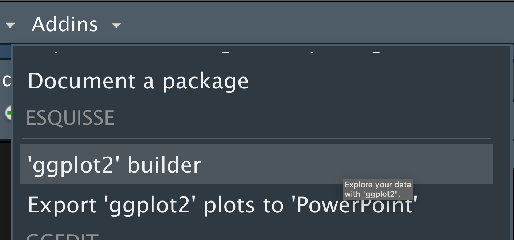
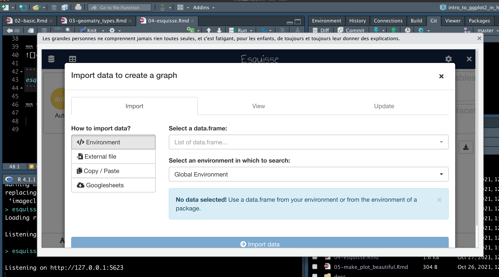
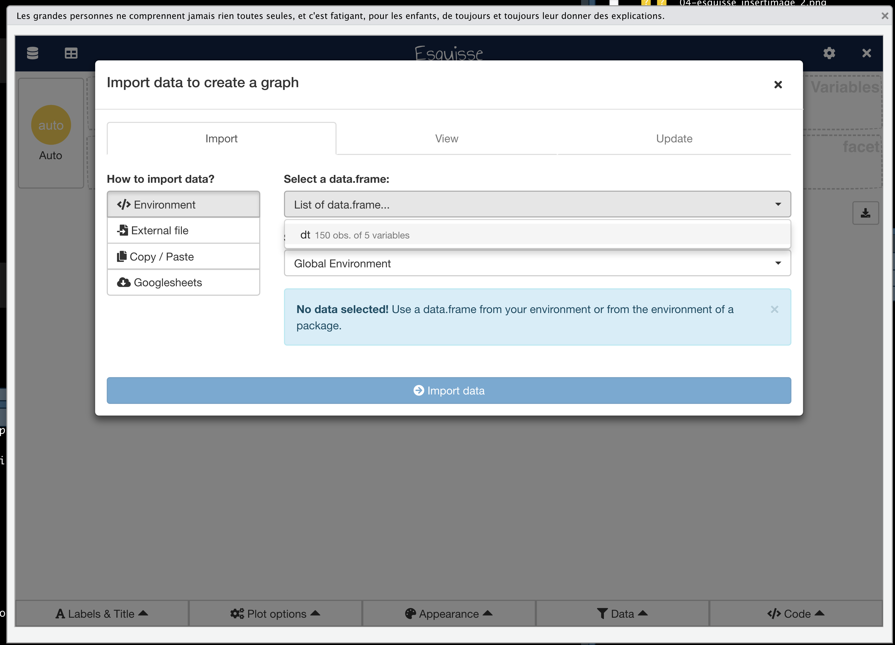
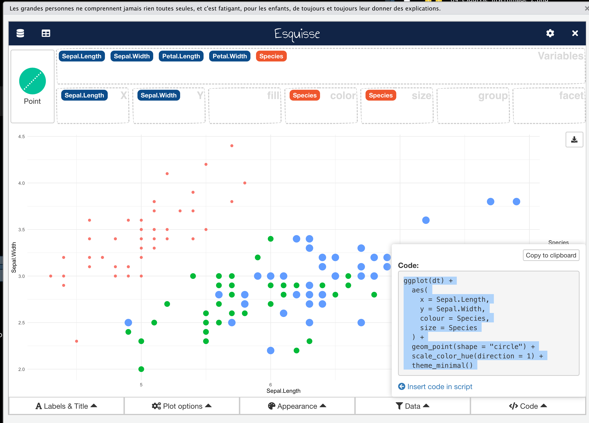

# esquisse

<div style="text-align:center;"><iframe width="560" height="315" src="https://www.youtube.com/embed/7-5G8I7Cpsw" title="YouTube video player" frameborder="0" allow="accelerometer; autoplay; clipboard-write; encrypted-media; gyroscope; picture-in-picture" allowfullscreen></iframe></div>

## ליצור גרפים בקלות בעזרת ממשק משתמש

הספריה
`esquisse`
היא ספריה שמציעה הרחבה לחבילה
`ggplot2`.
בעזרתה תוכלו ליצור גרף על ידי גרירת ולחיצה על כפתורים בממשק משתמש. לאחר שתיצרו גרף בממשק המשתמש, ייוצר קוד באופן אוטומטי עבור הגרף, תוכלו להעתיק את הקוד, ולהדביק אותו בספקיפט שלכם. אני ממליץ לשחק עם הספריה ולראות איך שינויים שאתם מבצעים משפיעים על הקוד הנוצר.

## איך להשתמש בספריה

### התקנה

ראשית יש להוריד את הספריה

```{r eval=FALSE, include=TRUE}
install.packages("esquisse")
```

לאחר מכן צריך לעשות ריסיט לסשן הנוכחי של 
Rsudio

```{r eval=FALSE, include=TRUE}
.rs.restartR()
```

מגניב, כעת הספריה מותקנת אצלכם!
יתכן ותתבקשו באופן אוטומטי להוריד עוד חבילות, פשוט לחצו
`yes`
ותנו לתוכנה לעשות את שלה...


### שימוש

לחצו על הכפתור הבא, או הריצו את הקוד הזה:


```{r eval=FALSE, include=TRUE}
esquisse:::esquisser()
```

ואז יפתח החלון הזה



בחרו מסד נתונים מתוך אלו שטעונים בסביבת העבודה שלכם



שחקו עם הספריה, צרו גרף, ולבסוף העתיקו את הקוד

